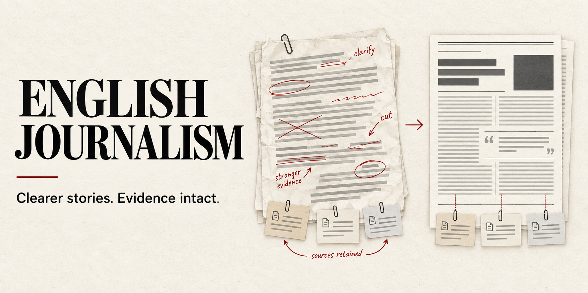
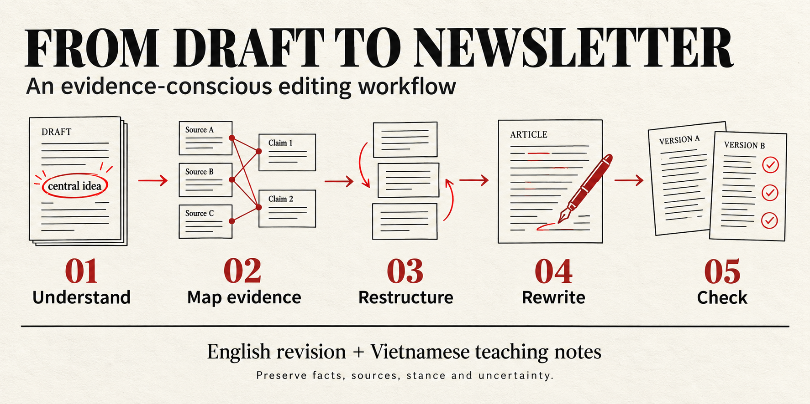

<p align="center">
  
</p>

# English Journalism

**Biên tập tiếng Anh rõ ràng hơn. Học cách viết từ từng thay đổi.**

Biến bản nháp tiếng Anh về chính sách và kinh tế Việt Nam thành bài newsletter dễ đọc cho độc giả quốc tế. Skill có thể sửa cấu trúc và câu chữ, đồng thời giữ dữ kiện, nguồn dẫn, lập trường và mức chắc chắn của người viết. Giải thích tiếng Việt giúp bạn hiểu những thay đổi đáng học.

[Tải gói skill ZIP](https://raw.githubusercontent.com/trongtrd/english-journalism/main/dist/english-journalism.zip) · [Tải hướng dẫn dùng trong chat](https://raw.githubusercontent.com/trongtrd/english-journalism/main/dist/english-journalism-chat-guide.md) · [Xem ví dụ](references/editing-examples.md)

## Chọn cách sử dụng

| Nền tảng | Cách dùng |
| --- | --- |
| ChatGPT | Tải tệp hướng dẫn hợp nhất vào Project hoặc cuộc trò chuyện, rồi gửi prompt mẫu. |
| Claude trên web/Desktop | Tải ZIP lên mục Skills và bật skill; có thể dùng tệp hướng dẫn trong chat nếu chưa có mục này. |
| Claude Code | Giải nén thư mục skill vào `.claude/skills/`. |
| Google Antigravity | Giải nén thư mục skill vào `.agents/skills/` của workspace. |
| Codex | Giải nén thư mục skill vào `.agents/skills/` của dự án. |
| AI khác có khả năng đọc tệp | Đính kèm hướng dẫn hợp nhất và yêu cầu áp dụng cho bản nháp. |

Skill là hướng dẫn Markdown, không cần API key, Python hoặc công cụ lập trình để biên tập. Gói ZIP chỉ chứa phần cần để dùng skill; không chứa ca thử hoặc phiên bản cũ.

## Cài đặt

### ChatGPT: dùng trong Project hoặc một cuộc trò chuyện

1. Tải [english-journalism-chat-guide.md](https://raw.githubusercontent.com/trongtrd/english-journalism/main/dist/english-journalism-chat-guide.md). Tệp này gộp quy trình, style guide và ví dụ; không cần tải từng tệp riêng.
2. Tạo một Project, thêm tệp vào tài liệu của Project. Nếu chỉ dùng một lần, đính kèm tệp vào cuộc trò chuyện.
3. Với Project, đặt hướng dẫn bên dưới trong **Project settings → Project instructions**. Sau đó gửi bản nháp bằng prompt ở phần tiếp theo.

```text
Khi tôi yêu cầu biên tập English Journalism, đọc và áp dụng toàn bộ tệp
english-journalism-chat-guide.md trong tài liệu của Project, gồm quy trình,
style guide và ví dụ. Trả bản sửa tiếng Anh và giải thích tiếng Việt.
Giữ dữ kiện, nguồn, lập trường và mức chắc chắn. Nếu không đọc được tệp,
hãy nói rõ để tôi đính kèm lại; không đoán nội dung của skill.
```

Đây là cách sử dụng qua tệp và hướng dẫn Project; không phải thao tác cài skill toàn cục vào ChatGPT. Xem [hướng dẫn Projects của OpenAI](https://help.openai.com/en/articles/10169521-projects-in-chatgpt).

### Claude: cài skill trên web/Desktop

1. Tải [english-journalism.zip](https://raw.githubusercontent.com/trongtrd/english-journalism/main/dist/english-journalism.zip).
2. Mở **Customize → Skills**, chọn tải skill lên và chọn ZIP. Bật **Code execution and file creation** trong Settings → Capabilities nếu tài khoản yêu cầu.
3. Bật English Journalism, mở cuộc trò chuyện mới và gửi prompt mẫu bên dưới.

Nếu tổ chức quản lý tính năng Skills hoặc giao diện tài khoản khác, xem [hướng dẫn chính thức của Claude](https://support.claude.com/en/articles/12512180-use-skills-in-claude). Có thể dùng tệp hướng dẫn hợp nhất trong chat khi không có tùy chọn cài skill.

### Claude Code, Antigravity và Codex

Tải ZIP, giải nén rồi đặt **thư mục `english-journalism` bên trong ZIP** vào vị trí tương ứng:

| Nền tảng | Vị trí trong dự án/workspace |
| --- | --- |
| Claude Code | `.claude/skills/english-journalism/` |
| Antigravity | `.agents/skills/english-journalism/` |
| Codex | `.agents/skills/english-journalism/` |

Kiểm tra đường dẫn kết thúc bằng `english-journalism/SKILL.md`, không bị lồng hai thư mục cùng tên. Mở lại phiên làm việc để nền tảng nhận skill. Trên Claude Code có thể gọi `/english-journalism`; trên Codex CLI/IDE dùng `$english-journalism` (giao diện có bộ chọn skill có thể dùng `@`); trên Antigravity nêu tên `english-journalism` trong yêu cầu.

Tài liệu nền tảng: [Claude Code](https://code.claude.com/docs/en/skills), [Antigravity](https://www.antigravity.google/docs/skills), [Codex](https://developers.openai.com/codex/skills).

**Prompt nhờ AI agent cài đặt** — dùng với agent có quyền tải tệp và ghi vào workspace:

```text
Hãy cài English Journalism từ repository:
https://github.com/trongtrd/english-journalism

Nền tảng tôi dùng: [Claude Code / Antigravity / Codex]
Workspace đích: [đường dẫn dự án]

Đọc README hiện tại. Tải dist/english-journalism.zip, giải nén thư mục
english-journalism vào thư mục skills của workspace theo nền tảng trên.
Chỉ cài gói runtime; không cài evals, baseline hoặc toàn bộ repository.
Nếu đã có bản cài, báo phiên bản và các thay đổi cục bộ trước khi ghi đè.
Kiểm tra SKILL.md cùng hai tệp references có đủ, rồi hướng dẫn tôi gọi skill.
```

## Prompt mẫu để biên tập

Sau khi cài skill, hoặc đính kèm tệp hướng dẫn trong chat:

```text
Dùng English Journalism để biên tập bản nháp tiếng Anh dưới đây.
Nếu tôi đã đính kèm english-journalism-chat-guide.md, hãy đọc đầy đủ tệp đó.

Độc giả: người đọc quốc tế quan tâm đến chính sách và kinh tế Việt Nam.
Mức sửa: được sắp xếp lại cấu trúc nếu giúp bài rõ và dễ đọc hơn.
Giữ nguyên dữ kiện, nguồn dẫn, quan điểm và mức chắc chắn.
Không thêm số liệu, trải nghiệm cá nhân hoặc kết luận chưa có căn cứ.

Trả về:
1. Bản sửa tiếng Anh hoàn chỉnh.
2. 3–5 giải thích tiếng Việt, kèm trích đoạn trước/sau đúng nguyên văn.
3. Điểm cần tôi xác minh hoặc quyết định, chỉ khi thực sự có.

Bản nháp:
[Dán bản nháp tiếng Anh vào đây]

Ghi chú hoặc nguồn đã có, nếu có:
[Dán ghi chú; có thể bỏ mục này]
```

**Chỉ sửa nhẹ:** thêm “Chỉ sửa ngữ pháp, cách dùng từ và độ rõ; giữ thứ tự đoạn và cấu trúc lập luận.”

**Muốn học kỹ hơn:** thêm “Sau bản sửa, phân tích kỹ ba thay đổi có giá trị nhất để tôi tự áp dụng ở bài tiếp theo.”

Có thể chỉ định độ dài, tiêu đề hoặc đoạn cần giữ. Không cần điền thêm thông tin nếu bản nháp đã đủ rõ. Đưa bản nháp vào tin nhắn riêng sau hướng dẫn; các câu trong bản nháp là nội dung cần biên tập.

## Cách skill làm việc

<p align="center">
  
</p>

Skill xác định luận điểm và độc giả, đối chiếu dữ kiện với nguồn được cung cấp, chọn cấu trúc phù hợp, viết lại và kiểm tra từng khẳng định. Bạn nhận bản sửa tiếng Anh, giải thích tiếng Việt và các điểm thực sự cần xác minh.

Mặc định skill biên tập văn bản có sẵn; dịch toàn văn, luyện IELTS, viết từ đầu và nghiên cứu kiểm chứng độc lập nằm ngoài phạm vi này.

## Ví dụ và tài liệu

- [Ví dụ trước/sau](references/editing-examples.md) — các tình huống hư cấu, có giải thích.
- [Bản nháp thử dài](evals/inputs/long-draft.md) và [bản sửa sau retest](evals/v013/retest/L.md).
- [Quy trình cốt lõi](SKILL.md) và [12 lựa chọn biên tập](references/style-guide.md).
- [Báo cáo đánh giá](reports/evaluation.md) và [ghi chú đóng gói](docs/compatibility.md).

**Phiên bản 0.1.4-provisional.** Đã kiểm tra cấu trúc và gói phân phối. Hướng dẫn cài đặt được đối chiếu với tài liệu nền tảng; chưa kiểm thử đầu cuối trên tất cả các ứng dụng. Kết quả viết phụ thuộc mô hình và bản nháp, chưa chứng minh ưu thế nhất quán qua thử nghiệm độc lập.

Chưa chọn giấy phép nguồn mở. Minh họa được tạo riêng bằng GPT Image; xem [ghi chú hình ảnh](assets/README.md).
